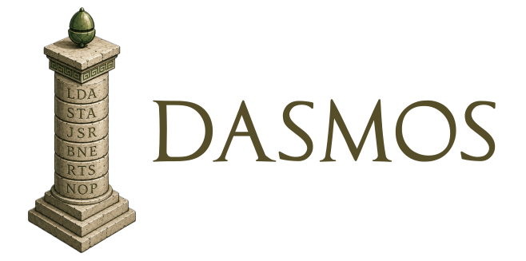

|

Dasmos
======

   *From Ancient Greek* δασμός *(dasmós, "division"), from* δαίω
   *(daíō, "to divide, share").*

An extensible tracing disassembler for classic-CPU ROMs, with
first-class support for the 6502 and the BBC Micro / Master family.

*Dasmos* has two surfaces. The :doc:`command line <cli>` runs the whole
pipeline against a binary in one shot — useful for triage, sanity
checks, and CI wiring. The :doc:`driver-script API <driver_api>` is
where serious analysis lives: a Python script declares labels,
subroutines, comments, data classifications, and cross-references, and
re-running the script regenerates the listing as the analysis evolves.

The CLI's ``dasmos init`` command bridges the two — it scaffolds a
runnable starter driver from the same options you'd pass to
``dasmos disassemble``.

Lineage and acknowledgements
----------------------------

*Dasmos* is a ground-up rewrite and reimagining of a heavily modified
`fork <https://github.com/acornaeology/py8dis>`_ of
`py8dis <https://github.com/ZornsLemma/py8dis>`_ — Steven Flintham's
original programmable tracing disassembler for the 6502 family.
*Dasmos* owes the whole core idea to Steven and to the py8dis project;
this project organises a tracing disassembler as a core algorithm
customised through plug-in extensions which provide knowledge of CPUs,
different assembly syntaxes, and target environments. The core of the
essential design vocabulary — driver scripts, traced classification,
label / comment / banner annotations — is all inspired by py8dis.

Driver scripts written for py8dis can be ported automatically to
*Dasmos* with the bundled ``scripts/py8dis2dasmos.py``.

.. toctree::
   :maxdepth: 2
   :caption: Contents

   cli
   driver_api
   cookbook_expressions
   cookbook
   api

Indices and tables
==================

* :ref:`genindex`
* :ref:`modindex`
* :ref:`search`
